# **Knowledge Nest**

**Knowledge Nest** is a full-stack web application for online learning and course management. It enables students to explore courses and enroll in courses of their choice, while instructors can create, manage, and analyze courses with detailed insights into number of students enrolled in each course and revenue earned by each course. Also in dashboard instructor can see the total number of student enrolled and revenue generated across all available courses. 

---

## **Features**

### **Authentication System**
- Secure user registration, login, and logout using **JWT** and **bcrypt.js**.
- Passwords are hashed for security.

### **Role-Based Access Control (RBAC)**
- **Students**:
  - Explore the available course catalog.
  - Access and manage their enrolled courses.
  - View detailed information about specific courses.
- **Instructors**:
  - Create, update, and delete courses.
  - Dashboard with analytics including:
    - Total number of students enrolled.
    - Revenue generated.
    - Details of enrolled students and their courses.

### **Protected Routes**
- Routes are restricted to authenticated and authorized users based on their roles.
-  For eg.., /instructor route accessible to only
authenticated instructor not to authenticated students and routes like /home, /courses, /course/details/:id, etc are accessible to only authenticated students not to authenticated instructors

### **Payment Integration**
- Integrated **PayPal** payment gateway for secure and seamless course enrollment payments.

### **Media Storage**
- **Cloudinary** integration for uploading and storing course images and other media files.

---

## **Libraries and Packages**

### **Backend**
- **express**: Web framework for Node.js.
- **mongoose**: MongoDB object modeling for Node.js.
- **jsonwebtoken**: JWT implementation for authentication.
- **bcryptjs**: Library for hashing and validating passwords.
- **cloudinary**: API for media file storage.
- **paypal-rest-sdk**: Integration with PayPal's payment gateway.

### **Frontend**
- **axios**: HTTP client for making API requests.
- **react-router-dom**: For navigation and routing.

---


## **Tech Stack**
- **Frontend**: React.js
- **Backend**: Node.js, Express.js
- **Database**: MongoDB
- **Authentication**: JWT, bcrypt.js
- **Payment**: PayPal REST SDK
- **File Storage**: Cloudinary

---
## **Project Walkthrough**

### Common Sign UP and Sign IN Page
- SING UP
[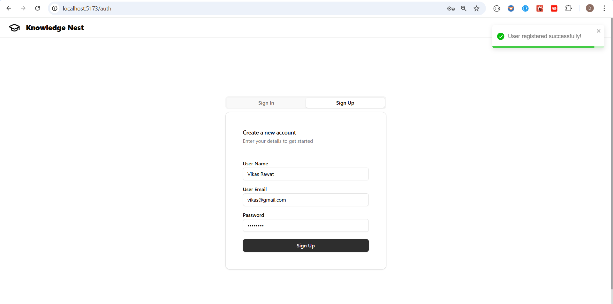](./assets/img2.png)
- SING IN
[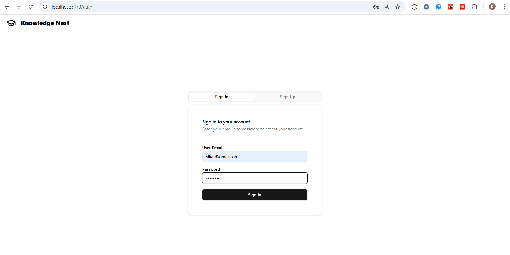](./assets/img2.png)

### STUDENTS VIEW
- HOME PAGE
[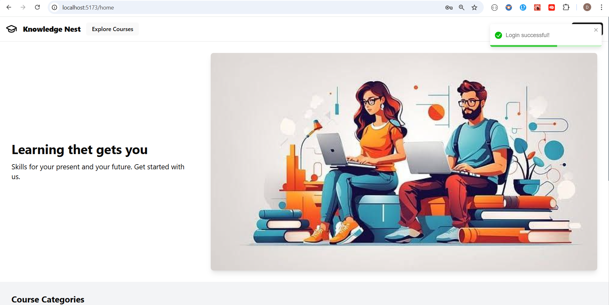](./assets/img3.png)
[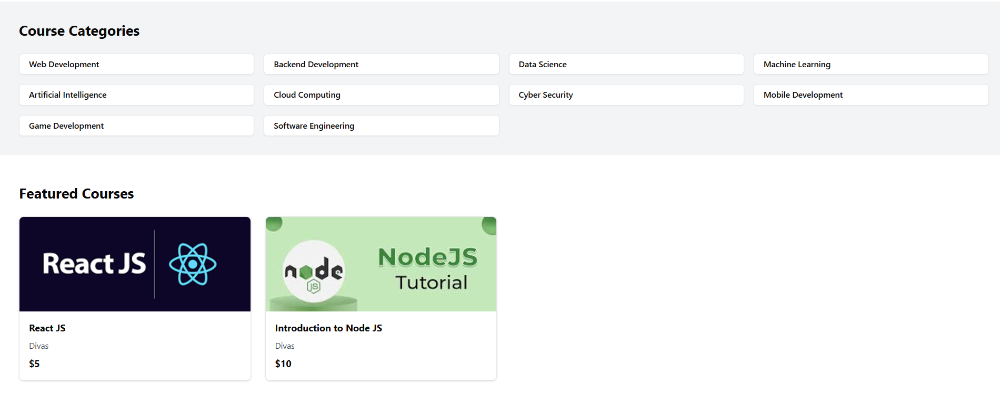](./assets/img4.png)
- COURSES PAGE
[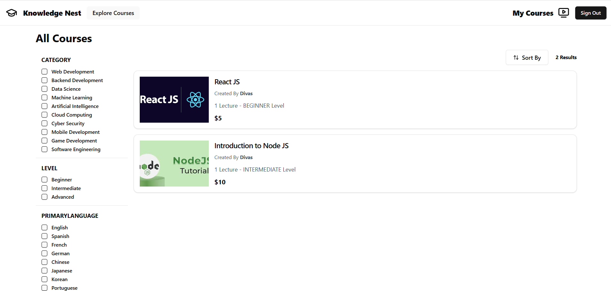](./assets/img5.png)
- FILTERED SEARCH
[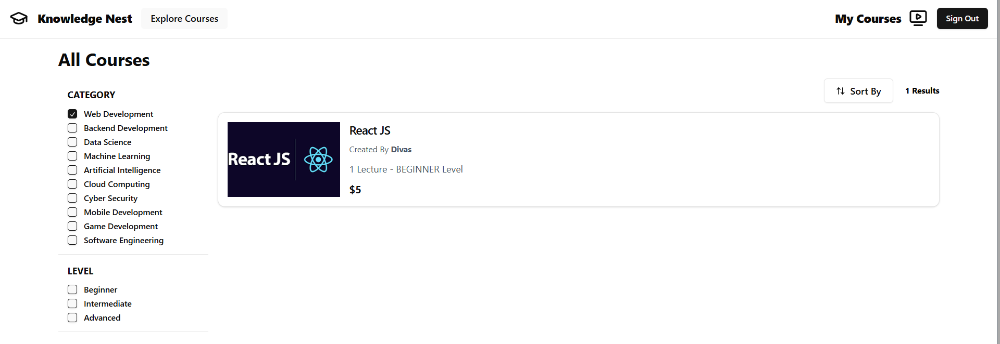](./assets/img6.png)
[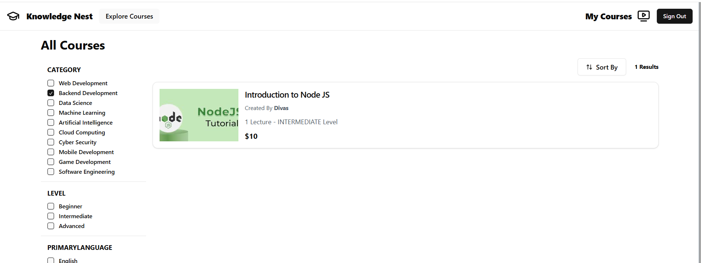](./assets/img7.png)
[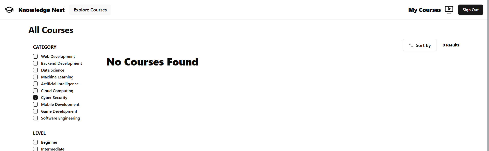](./assets/img8.png)
- COURSE DETAILS PAGE
[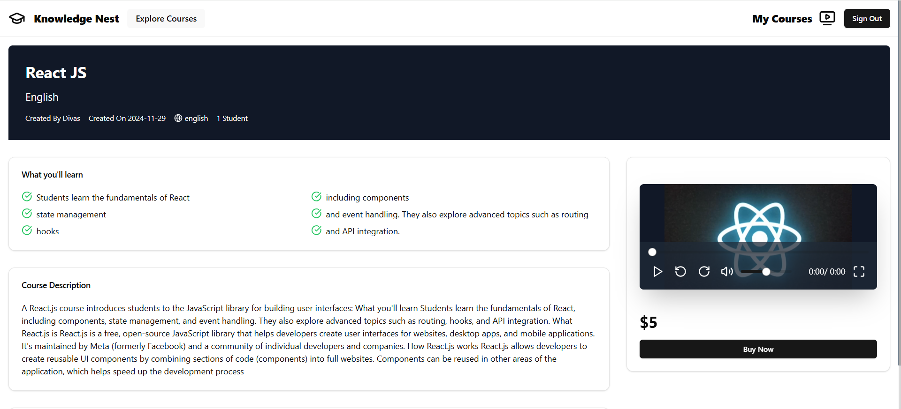](./assets/img10.png)
- MY COURSE PAGE
[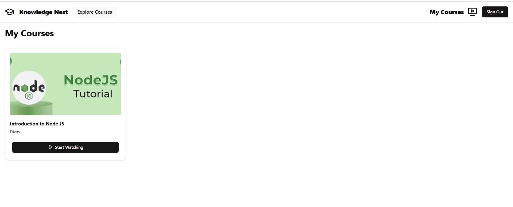](./assets/img11.png)
- COURSE PROGRESS PAGE
[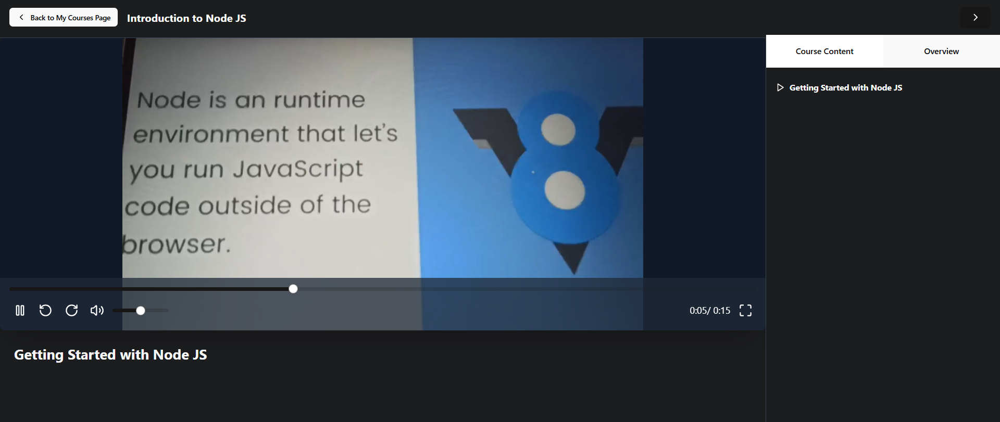](./assets/img12.png)
[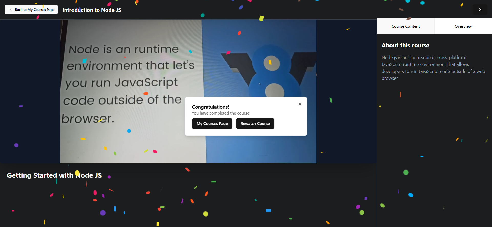](./assets/img13.png)

### **INSTRUCTORS VIEW**
- DASHBOARD FOR COURSE ANALYTICS (eg, Revenue Earned)
[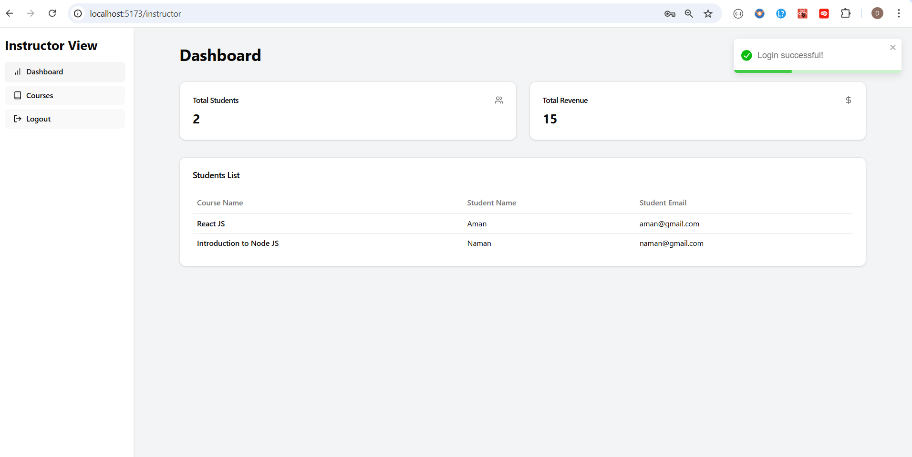](./assets/img14.png)
- CREATE, VIEW, EDIT, DELETE COURSES
[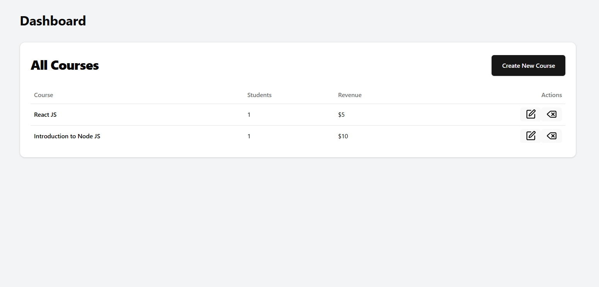](./assets/img15.png)
[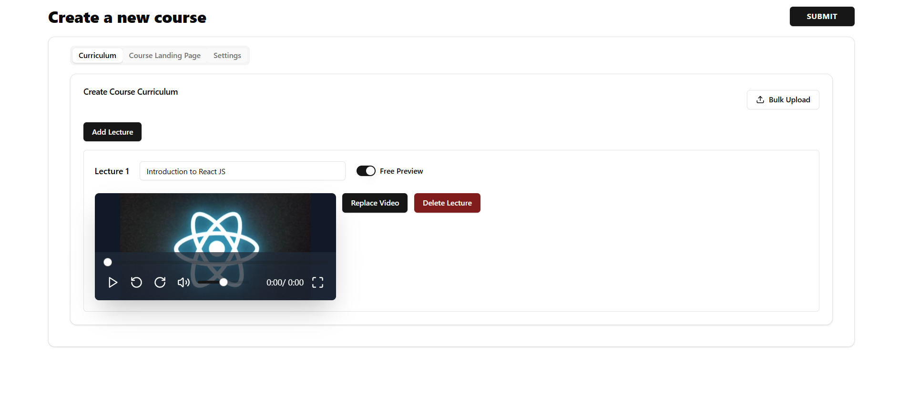](./assets/img16.png)
[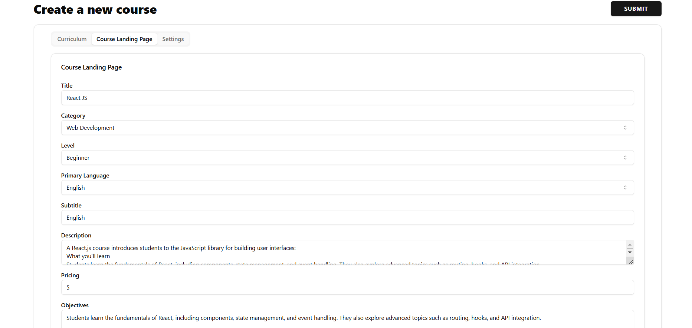](./assets/img17.png)
[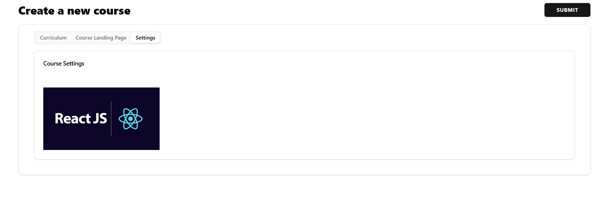](./assets/img18.png)


---

## **Installation and Setup**

### **Prerequisites**
1. Install **Node.js** and **npm**.
2. Set up **MongoDB** (local instance or MongoDB Atlas).
3. Create accounts on **Cloudinary** and **PayPal Developer Portal** to get API credentials.

### **Clone the Repository**
```bash
git clone https://github.com/Divas-Sagta/knowledge-nest.git
cd knowledge-nest
```
### **Backend Setup**
1. Navigate to the server directory
   ```bash 
   cd server
2. Install dependencies:
   ```bash
   npm install
3. Create a .env file in the server directory with the following environment variables:
   ```bash
   PORT= backend_server_port
   MONGO_URI= your_mongodb_connection_string
   CLIENT_URL= url_where_frontend_is_running
   CLOUDINARY_CLOUD_NAME= your_cloud_name
   CLOUDINARY_API_KEY= your_api_key
   CLOUDINARY_API_SECRET= your_api_secret
   PAYPAL_CLIENT_ID= your_paypal_client_id
   PAYPAL_CLIENT_SECRET= your_paypal_client_secret

4. Start Backend Server
   ```bash
   npm run dev


### **Frontend Set Up**

1. Navigate to the client directory:
   ```bash
   cd client
2. Install dependencies:
   ```bash
   npm install
3. Start the frontend server:
   ```bash
   npm run dev
   ```


